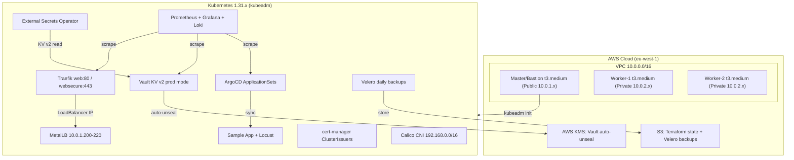
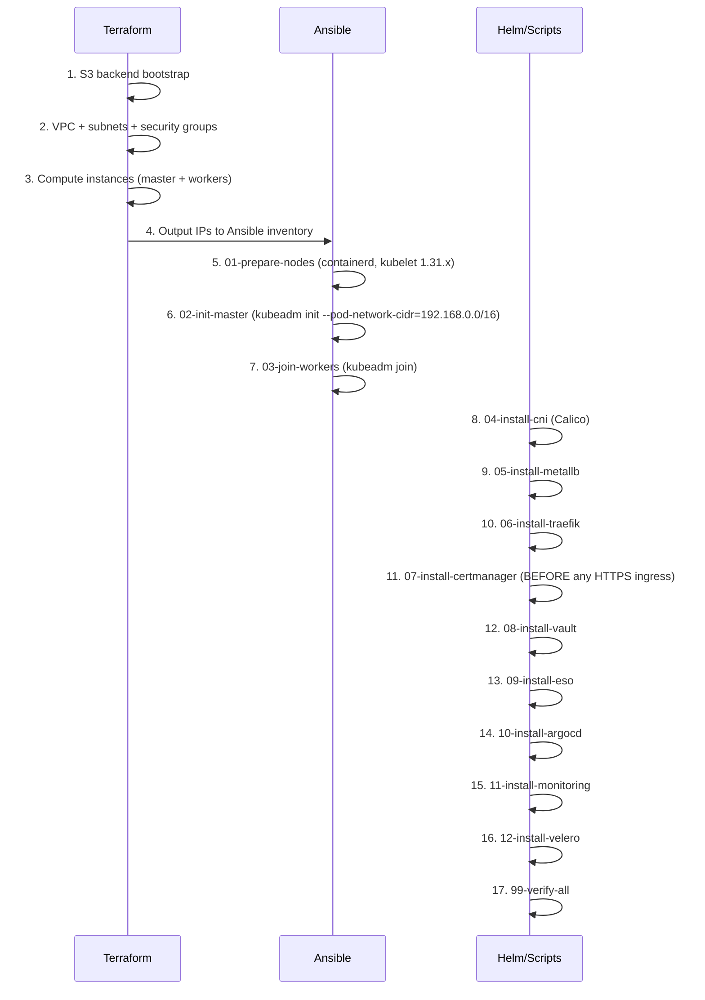

# Design: Production-Grade Kubernetes DevSecOps Platform

## Overview

This document describes the technical architecture and design decisions for the K8s DevSecOps platform. The platform is built on self-managed Kubernetes (kubeadm) provisioned by Terraform and configured by Ansible, with a full suite of platform services deployed via Helm and managed via GitOps (ArgoCD). Every design decision explicitly addresses the V0 regression table from requirements.md.

### Design Goals

- Reproducible: every layer (infra, cluster, platform) is code-driven and idempotent
- Secure by default: zero-trust networking, no hardcoded secrets, least-privilege RBAC
- Observable: metrics, logs, and alerts from day one
- Recoverable: automated backups and documented DR procedures
- Approachable: numbered scripts and a single config.env lower the barrier for newcomers

### Deployment Phases

The platform deploys in two distinct phases to allow clean lifecycle management:

- Phase 1 — Infrastructure: VPC, compute instances, S3 state backend (Terraform)
- Phase 2 — Platform: Kubernetes cluster bootstrap (Ansible) + all Helm-based services

Separating phases prevents the finalizer destruction loop from V0 (Req 13 AC-1).

---

## Architecture

### Component Relationship Diagram



### Deployment Sequence



cert-manager is installed at step 11, before any HTTPS ingress resources are created.
This is the explicit fix for the V0 cert-manager webhook timeout (Req 6 AC-2, Req 3 AC-3).

---

## Components and Interfaces

### Terraform Modules

#### `modules/vpc`
- Inputs: `cidr_block`, `public_subnet_cidr`, `private_subnet_cidr`, `region`
- Outputs: `vpc_id`, `public_subnet_id`, `private_subnet_id`, `security_group_ids`
- Creates: VPC, public subnet, private subnet, internet gateway, route tables, security groups
- Security groups open: 22 (SSH), 80 (HTTP), 443 (HTTPS), 6443 (K8s API), 2379-2380 (etcd), 10250-10259 (kubelet/metrics)

#### `modules/compute`
- Inputs: `instance_type`, `master_count`, `worker_count`, `subnet_ids`, `key_name`, `ami_id`
- Outputs: `master_public_ip`, `worker_private_ips`, `bastion_ssh_command`
- Validation: rejects instance types with less than 4GB RAM via `precondition` block (Req 1 AC-2)
- Creates: EC2 instances tagged with role (master/worker), Elastic IP for master

#### `modules/destroy`
- Purpose: pre-destroy hooks that patch Kubernetes finalizers before `terraform destroy`
- Uses `null_resource` with `when = destroy` local-exec to run `kubectl patch` and `kubeadm reset`
- Runs in reverse dependency order: apps then operators then namespaces then cluster (Req 13 AC-2)

### Ansible Roles

| Role | Purpose |
|------|---------|
| `common` | OS updates, kernel modules (overlay, br_netfilter), sysctl |
| `containerd` | Install containerd, configure SystemdCgroup = true |
| `kubernetes` | Install kubelet/kubeadm/kubectl at pinned 1.31.x, apt-mark hold |
| `kubeadm-master` | kubeadm init, kubeconfig, save join command to file |
| `kubeadm-worker` | Retrieve join command from master, execute kubeadm join |

### Platform Service Interface Table

| Service | Namespace | Helm Chart | Ingress Host | ServiceMonitor Label |
|---------|-----------|-----------|-------------|---------------------|
| Traefik | traefik | traefik/traefik | (is the ingress) | release: prometheus |
| cert-manager | cert-manager | jetstack/cert-manager | — | release: prometheus |
| Vault | vault | hashicorp/vault | vault.${DOMAIN} | release: prometheus |
| ESO | external-secrets | external-secrets/external-secrets | — | release: prometheus |
| ArgoCD | argocd | argo/argo-cd | argocd.${DOMAIN} | release: prometheus |
| Prometheus | monitoring | prometheus-community/kube-prometheus-stack | prometheus.${DOMAIN} | (self) |
| Grafana | monitoring | (in kube-prometheus-stack) | grafana.${DOMAIN} | release: prometheus |
| Loki | monitoring | grafana/loki-stack | — | release: prometheus |
| Velero | velero | vmware-tanzu/velero | — | release: prometheus |

All ingress resources use `traefik.ingress.kubernetes.io/router.entrypoints: web` by default.
This is the explicit fix for the V0 Traefik 404 issue (Req 5 AC-2).

---

## Data Models

### config.env — Single Source of Truth

All scripts source `scripts/lib/config.env`. This is the only file a user needs to edit for a new deployment.

```bash
# Node IPs (output from terraform)
MASTER_IP="10.0.1.10"
WORKER_IPS=("10.0.2.11" "10.0.2.12")

# Kubernetes
K8S_VERSION="1.31.3-1.1"
POD_CIDR="192.168.0.0/16"

# MetalLB — MUST be within node subnet (V0 fix: Req 4 AC-3)
METALLB_IP_RANGE="10.0.1.200-10.0.1.220"

# Domain (use nip.io for testing, real domain for LE prod)
DOMAIN="${MASTER_IP}.nip.io"

# Vault
VAULT_NAMESPACE="vault"
VAULT_ADDR="http://vault.${DOMAIN}"

# Registry
REGISTRY="ghcr.io"
REGISTRY_USER="your-github-username"

# Backup
VELERO_BUCKET="k8s-platform-velero-backups"
AWS_REGION="eu-west-1"
```

### Vault Secret Path Schema

All secrets follow the KV v2 path convention. The `/data/` segment is required by the KV v2 API
and was the root cause of empty secrets in V0 (Req 7 AC-3).

```
secret/data/platform/argocd    -> argocd-admin-password
secret/data/platform/grafana   -> grafana-admin-password
secret/data/platform/registry  -> registry-pull-secret
secret/data/apps/sample-app    -> app-specific secrets
```

The ESO ClusterSecretStore is configured with `path: secret` and `version: v2`. ESO automatically
constructs the full `secret/data/<path>` URL when `version: v2` is set, so ExternalSecret resources
reference only the logical path (e.g., `platform/argocd`).

### ExternalSecret Resource Model

```yaml
apiVersion: external-secrets.io/v1beta1
kind: ExternalSecret
metadata:
   name: argocd-admin-secret
   namespace: argocd
spec:
   refreshInterval: 1h
   secretStoreRef:
      name: vault-cluster-store
      kind: ClusterSecretStore
   target:
      name: argocd-admin-secret
      creationPolicy: Owner
   data:
      - secretKey: password
        remoteRef:
           key: platform/argocd
           property: argocd-admin-password
```

### ArgoCD ApplicationSet Model

```yaml
apiVersion: argoproj.io/v1alpha1
kind: ApplicationSet
metadata:
   name: platform-apps
   namespace: argocd
spec:
   generators:
      - list:
           elements:
              - env: dev
                namespace: app-dev
              - env: prod
                namespace: app-prod
   template:
      metadata:
         name: "sample-app-{{env}}"
      spec:
         project: default
         source:
            repoURL: https://github.com/org/k8s-platform-kiro
            targetRevision: HEAD
            path: "manifests/sample-app/overlays/{{env}}"
         destination:
            server: https://kubernetes.default.svc
            namespace: "{{namespace}}"
         syncPolicy:
            automated:
               prune: true
               selfHeal: true
```

### Network Policy Model

Every application namespace receives two baseline NetworkPolicy resources at creation time.

Default-deny-all:

```yaml
apiVersion: networking.k8s.io/v1
kind: NetworkPolicy
metadata:
   name: default-deny-all
spec:
   podSelector: {}
   policyTypes:
      - Ingress
      - Egress
```

Allow DNS egress (required for CoreDNS resolution):

```yaml
apiVersion: networking.k8s.io/v1
kind: NetworkPolicy
metadata:
   name: allow-dns-egress
spec:
   podSelector: {}
   policyTypes:
      - Egress
   egress:
      - ports:
           - port: 53
             protocol: UDP
           - port: 53
             protocol: TCP
```

cert-manager webhook NetworkPolicy (V0 fix for webhook timeout, Req 3 AC-3):

```yaml
apiVersion: networking.k8s.io/v1
kind: NetworkPolicy
metadata:
   name: allow-apiserver-to-webhook
   namespace: cert-manager
spec:
   podSelector:
      matchLabels:
         app.kubernetes.io/component: webhook
   ingress:
      - ports:
           - port: 10250
           - port: 6080
```

---

## Infrastructure Layer Design

### Terraform State Backend

The S3 backend is bootstrapped once manually before any other Terraform operations.
A `bootstrap/` directory contains the S3 bucket and DynamoDB lock table creation.

```hcl
terraform {
   backend "s3" {
      bucket         = "k8s-platform-tfstate"
      key            = "platform/terraform.tfstate"
      region         = "eu-west-1"
      dynamodb_table = "k8s-platform-tflock"
      encrypt        = true
   }
}
```

### VPC Design

```
VPC: 10.0.0.0/16
├── Public Subnet:  10.0.1.0/24  (master/bastion, MetalLB pool 10.0.1.200-220)
└── Private Subnet: 10.0.2.0/24  (worker nodes)
```

The master node sits in the public subnet with an Elastic IP for SSH and kubectl API access (port 6443).
Workers sit in the private subnet and communicate with the master via VPC internal routing.
MetalLB IP pool (10.0.1.200-10.0.1.220) is within the public subnet range, satisfying Req 4 AC-1
and preventing the V0 Pending service issue (Req 4 AC-3).

### Instance Sizing Validation

Terraform `precondition` blocks enforce minimum sizing at plan time (Req 1 AC-2):

```hcl
variable "instance_type" {
   type = string
   validation {
      condition = contains([
         "t3.medium", "t3.large", "t3.xlarge",
         "m5.large", "m5.xlarge"
      ], var.instance_type)
      error_message = "Instance type must be t3.medium or larger (minimum 4GB RAM, 2 vCPUs)."
   }
}
```

### Terraform Outputs

```hcl
output "master_public_ip"   { value = module.compute.master_public_ip }
output "worker_private_ips" { value = module.compute.worker_private_ips }
output "ssh_command"        { value = "ssh -i ~/.ssh/k8s-key.pem ubuntu@${module.compute.master_public_ip}" }
```

---

## Cluster Bootstrap Design

### Node Preparation (Ansible: 01-prepare-nodes.yml)

Executed against all nodes in parallel:

1. Disable swap: `swapoff -a` and comment out swap line in `/etc/fstab`
2. Load kernel modules: `overlay`, `br_netfilter` via `/etc/modules-load.d/k8s.conf`
3. Apply sysctl: `net.bridge.bridge-nf-call-iptables=1`, `net.ipv4.ip_forward=1`
4. Install containerd from official apt repo, write `/etc/containerd/config.toml` with `SystemdCgroup = true`
5. Install `kubelet=1.31.x`, `kubeadm=1.31.x`, `kubectl=1.31.x` and `apt-mark hold` all three

The `SystemdCgroup = true` setting is critical — without it, kubelet and containerd use different
cgroup drivers, causing node NotReady status.

### kubeadm Init (Ansible: 02-init-master.yml)

```yaml
- name: kubeadm init
  command: >
     kubeadm init
     --pod-network-cidr={{ pod_cidr }}
     --kubernetes-version={{ k8s_version }}
  register: kubeadm_output

- name: Save join command
  copy:
     content: "{{ kubeadm_output.stdout | regex_search('kubeadm join.*') }}"
     dest: /tmp/kubeadm-join-command.sh
```

The `--pod-network-cidr=192.168.0.0/16` must match the Calico IPPool CIDR exactly (Req 3 AC-1).

### Worker Join (Ansible: 03-join-workers.yml)

The join task includes an idempotency guard to prevent re-joining already-joined nodes (Req 12 AC-2):

```yaml
- name: Check if already joined
  command: kubectl get node {{ inventory_hostname }}
  delegate_to: "{{ groups['masters'][0] }}"
  register: node_check
  failed_when: false

- name: Execute join command
  command: "bash /tmp/kubeadm-join-command.sh"
  when: node_check.rc != 0
```

---

## Networking Design

### Calico CNI

Calico is deployed via the official Tigera operator manifest. The IPPool matches the kubeadm
`--pod-network-cidr` exactly (Req 3 AC-1):

```yaml
apiVersion: operator.tigera.io/v1
kind: Installation
metadata:
   name: default
spec:
   calicoNetwork:
      ipPools:
         - blockSize: 26
           cidr: 192.168.0.0/16
           encapsulation: VXLANCrossSubnet
           natOutgoing: Enabled
           nodeSelector: all()
```

`VXLANCrossSubnet` encapsulation is used because master and workers are in different subnets
(public/private). This avoids BGP peering requirements while maintaining pod-to-pod connectivity.

### MetalLB Design

MetalLB operates in Layer 2 mode (ARP-based). The IP pool is within the node subnet to ensure
ARP responses are routable — this is the explicit fix for the V0 Pending service issue (Req 4 AC-3):

```yaml
apiVersion: metallb.io/v1beta1
kind: IPAddressPool
metadata:
   name: node-subnet-pool
   namespace: metallb-system
spec:
   addresses:
      - 10.0.1.200-10.0.1.220
---
apiVersion: metallb.io/v1beta1
kind: L2Advertisement
metadata:
   name: l2-advert
   namespace: metallb-system
spec:
   ipAddressPools:
      - node-subnet-pool
```

The install script validates that `METALLB_IP_RANGE` is within the node subnet before applying,
and exits with a clear error if the range is outside the subnet (Req 4 AC-3).

### Default-Deny Network Policies

Applied to every application namespace at creation time. The policy model is:

- Default: deny all ingress and egress
- Explicit allow: DNS egress to kube-system (CoreDNS)
- Explicit allow: ingress from traefik namespace (for HTTP routing)
- Explicit allow: egress to vault namespace (for ESO secret sync)
- Explicit allow: egress to monitoring namespace (for metrics scraping)

This implements zero-trust networking as requested by community reviewers Nick Gole and Aldy (Req 3 AC-2).

---

## Ingress and TLS Design

### Traefik Entrypoints

Traefik is configured with both entrypoints but `web` is the default for all ingress resources:

```yaml
# manifests/traefik/values.yaml
ports:
   web:
      port: 80
      expose: true
      exposedPort: 80
   websecure:
      port: 443
      expose: true
      exposedPort: 443
      tls:
         enabled: false
```

Design decision: `websecure` TLS is NOT enabled globally. Each ingress resource that needs TLS
explicitly references a cert-manager-issued secret. This prevents the V0 scenario where websecure
was the default entrypoint but no TLS secret existed, causing 404 on all routes (Req 5 AC-2).

### Ingress Annotation Pattern

```yaml
# Default — HTTP only, safe for initial setup
annotations:
   traefik.ingress.kubernetes.io/router.entrypoints: web

# Upgraded — HTTPS, only after cert-manager has issued the certificate
annotations:
   traefik.ingress.kubernetes.io/router.entrypoints: websecure
   traefik.ingress.kubernetes.io/router.tls: "true"
```

### cert-manager ClusterIssuers

Three ClusterIssuers are created in order:

```yaml
# 1. Self-signed (always works, no external dependency)
apiVersion: cert-manager.io/v1
kind: ClusterIssuer
metadata:
   name: selfsigned-issuer
spec:
   selfSigned: {}
---
# 2. Let's Encrypt Staging (test ACME flow without rate limits)
apiVersion: cert-manager.io/v1
kind: ClusterIssuer
metadata:
   name: letsencrypt-staging
spec:
   acme:
      server: https://acme-staging-v02.api.letsencrypt.org/directory
      email: admin@example.com
      privateKeySecretRef:
         name: letsencrypt-staging-key
      solvers:
         - http01:
              ingress:
                 class: traefik
---
# 3. Let's Encrypt Production (real certs — use only with registered domain)
apiVersion: cert-manager.io/v1
kind: ClusterIssuer
metadata:
   name: letsencrypt-prod
spec:
   acme:
      server: https://acme-v02.api.letsencrypt.org/directory
      email: admin@example.com
      privateKeySecretRef:
         name: letsencrypt-prod-key
      solvers:
         - http01:
              ingress:
                 class: traefik
```

nip.io domains default to `selfsigned-issuer` because Let's Encrypt does not issue certificates
for nip.io (Req 6 AC-4). The install script detects nip.io in `DOMAIN` and sets the issuer accordingly.

### TLS Upgrade Path

```
Initial deploy  -> web entrypoint, no TLS (safe, always works)
Testing phase   -> selfsigned-issuer + websecure entrypoint
Staging phase   -> letsencrypt-staging + websecure entrypoint
Production      -> letsencrypt-prod + websecure entrypoint
```

---

## Secrets Management Design

### Vault Deployment

Vault is deployed in production mode with a persistent volume for storage (Req 7 AC-1):

```yaml
# manifests/vault/values.yaml
server:
   standalone:
      enabled: true
      config: |
         ui = true
         listener "tcp" {
            tls_disable = 1
            address = "[::]:8200"
         }
         storage "file" {
            path = "/vault/data"
         }
         seal "awskms" {
            region     = "eu-west-1"
            kms_key_id = "alias/vault-unseal-key"
         }
   dataStorage:
      enabled: true
      size: 10Gi
      storageClass: standard
```

The `storage "file"` backend with a PersistentVolume ensures secrets survive pod restarts,
fixing the V0 dev-mode memory-only storage issue (Req 7 AC-1). AWS KMS auto-unseal is the
default. For environments without KMS, the install script documents the manual unseal procedure
and stores unseal keys in a local encrypted file (never committed to Git).

### Vault Initialization Sequence

```bash
# 08-install-vault.sh
vault operator init -key-shares=5 -key-threshold=3 -format=json > /tmp/vault-init.json
vault secrets enable -path=secret kv-v2
vault auth enable kubernetes
vault write auth/kubernetes/config \
   kubernetes_host="https://${KUBERNETES_PORT_443_TCP_ADDR}:443"
vault policy write external-secrets - <<EOF
path "secret/data/*" { capabilities = ["read"] }
EOF
vault write auth/kubernetes/role/external-secrets \
   bound_service_account_names=external-secrets \
   bound_service_account_namespaces=external-secrets \
   policies=external-secrets \
   ttl=24h
```

### ESO ClusterSecretStore

```yaml
apiVersion: external-secrets.io/v1beta1
kind: ClusterSecretStore
metadata:
   name: vault-cluster-store
spec:
   provider:
      vault:
         server: "http://vault.vault.svc.cluster.local:8200"
         path: "secret"
         version: "v2"
         auth:
            kubernetes:
               mountPath: "kubernetes"
               role: "external-secrets"
               serviceAccountRef:
                  name: external-secrets
                  namespace: external-secrets
```

Setting `version: "v2"` causes ESO to automatically use the `secret/data/<path>` URL format.
This is the fix for the V0 empty secrets issue (Req 7 AC-3).

---

## GitOps Design

### ArgoCD Deployment

ArgoCD is deployed with the web entrypoint to avoid Host header port mismatch when accessed
via SSH tunnel (V0 fix for Req 8 AC-4):

```yaml
# manifests/argocd/values.yaml
server:
   ingress:
      enabled: true
      annotations:
         traefik.ingress.kubernetes.io/router.entrypoints: web
      hosts:
         - argocd.${DOMAIN}
   extraArgs:
      - --insecure
```

The `--insecure` flag disables ArgoCD's own TLS, delegating TLS termination to Traefik.
This prevents the double-TLS issue that caused connection resets in V0.

### ApplicationSet Strategy

Two generators are supported:

1. List generator: explicit environment list (dev/prod) — used for the sample app
2. Directory generator: scans `manifests/apps/` for subdirectories — used for future apps

The ApplicationSet template enforces automated sync with self-heal and prune enabled,
ensuring the cluster state always matches Git (Req 8 AC-3).

### ArgoCD Project Scoping

```yaml
apiVersion: argoproj.io/v1alpha1
kind: AppProject
metadata:
   name: platform
   namespace: argocd
spec:
   sourceRepos:
      - "https://github.com/org/k8s-platform-kiro"
   destinations:
      - namespace: "app-*"
        server: https://kubernetes.default.svc
   clusterResourceWhitelist:
      - group: ""
        kind: Namespace
```

---

## Observability Design

### kube-prometheus-stack Configuration

```yaml
# manifests/monitoring/kube-prometheus-values.yaml
prometheus:
   prometheusSpec:
      serviceMonitorSelector:
         matchLabels:
            release: prometheus
      storageSpec:
         volumeClaimTemplate:
            spec:
               resources:
                  requests:
                     storage: 20Gi
grafana:
   persistence:
      enabled: true
      size: 5Gi
   dashboardProviders:
      dashboardproviders.yaml:
         providers:
            - name: default
              folder: Platform
              type: file
              options:
                 path: /var/lib/grafana/dashboards/default
   dashboards:
      default:
         cluster-overview:
            gnetId: 17346
            revision: 1
            datasource: Prometheus
alertmanager:
   alertmanagerSpec:
      storage:
         volumeClaimTemplate:
            spec:
               resources:
                  requests:
                     storage: 2Gi
```

The `serviceMonitorSelector.matchLabels.release: prometheus` is the critical fix for the V0
Prometheus not scraping Traefik issue (Req 9 AC-2). Every ServiceMonitor in the platform
MUST include this label.

### ServiceMonitor Pattern

All platform components follow this pattern:

```yaml
apiVersion: monitoring.coreos.com/v1
kind: ServiceMonitor
metadata:
   name: traefik-metrics
   namespace: traefik
   labels:
      release: prometheus
spec:
   selector:
      matchLabels:
         app.kubernetes.io/name: traefik
   endpoints:
      - port: metrics
        interval: 30s
```

### Loki Stack

Loki is deployed alongside Promtail for log collection:

```yaml
# manifests/monitoring/loki-values.yaml
loki:
   persistence:
      enabled: true
      size: 10Gi
promtail:
   enabled: true
   config:
      clients:
         - url: http://loki:3100/loki/api/v1/push
```

Grafana is pre-configured with Loki as a datasource, enabling log correlation with metrics
in the same dashboard (Req 9 AC-6).

### Prometheus Operator Recovery Procedure

If the Prometheus Operator pod crashes (V0 cascading failure, Req 9 AC-5):

```bash
kubectl rollout restart deployment/prometheus-operator -n monitoring
kubectl wait --for=condition=available deployment/prometheus-operator -n monitoring --timeout=120s
```

---

## RBAC and Security Design

### ServiceAccount Strategy

Each platform component uses a dedicated ServiceAccount with minimal permissions (Req 10 AC-1):

| Component | ServiceAccount | Namespace | Key Permissions |
|-----------|---------------|-----------|----------------|
| ArgoCD Server | argocd-server | argocd | get/list/watch all resources |
| ArgoCD App Controller | argocd-application-controller | argocd | full cluster access (required) |
| Vault | vault | vault | tokenreviews, auth delegation |
| ESO | external-secrets | external-secrets | secrets CRUD in target namespaces |
| Prometheus | prometheus-kube-prometheus | monitoring | get/list/watch pods, services, endpoints |
| Velero | velero | velero | full cluster access (backup requires it) |

No component uses the `default` ServiceAccount.

### Namespace Isolation

When a new application namespace is created, the following resources are automatically applied:

1. `NetworkPolicy/default-deny-all` — zero-trust baseline
2. `NetworkPolicy/allow-dns-egress` — CoreDNS resolution
3. `ResourceQuota/default-quota` — prevents resource exhaustion (Req 10 AC-3)
4. `LimitRange/default-limits` — sets default container resource limits

```yaml
apiVersion: v1
kind: ResourceQuota
metadata:
   name: default-quota
spec:
   hard:
      requests.cpu: "4"
      requests.memory: 4Gi
      limits.cpu: "8"
      limits.memory: 8Gi
      pods: "20"
```

### Security Hardening Checklist

- Default passwords changed: ArgoCD admin, Grafana admin, Vault root token rotated post-install (Req 15 AC-1)
- No public service exposure: all services accessed via SSH tunnel or Tailscale (Req 15 AC-2)
- Private registry: ghcr.io with pull secret managed via ESO (Req 15 AC-3)
- No plaintext secrets in Git: all secrets in Vault, synced via ESO (Req 15 AC-4)
- Audit logging: Kubernetes audit policy enabled, Vault audit device configured (Req 15 AC-5)

---

## Backup Design

### Velero Schedule

Daily backups at 02:00 UTC with 30-day retention, stored in S3:

```bash
# 12-install-velero.sh
velero install \
   --provider aws \
   --plugins velero/velero-plugin-for-aws:v1.8.0 \
   --bucket ${VELERO_BUCKET} \
   --backup-location-config region=${AWS_REGION} \
   --snapshot-location-config region=${AWS_REGION} \
   --secret-file /tmp/velero-credentials

velero schedule create daily-full-backup \
   --schedule="0 2 * * *" \
   --ttl 720h0m0s
```

### etcd Snapshot Backup

etcd snapshots are taken independently of Velero, providing a lower-level recovery option:

```bash
ETCDCTL_API=3 etcdctl snapshot save \
   /backup/etcd-snapshot-$(date +%Y%m%d-%H%M%S).db \
   --endpoints=https://127.0.0.1:2379 \
   --cacert=/etc/kubernetes/pki/etcd/ca.crt \
   --cert=/etc/kubernetes/pki/etcd/server.crt \
   --key=/etc/kubernetes/pki/etcd/server.key
```

Snapshots are synced to S3 via a post-snapshot hook. A Kubernetes CronJob on the master
node runs this script daily at 03:00 UTC.

### Disaster Recovery Test Procedure

1. Select a backup: `velero backup get`
2. Delete the target namespace: `kubectl delete namespace sample-app`
3. Restore: `velero restore create --from-backup daily-full-backup-<date>`
4. Verify: `kubectl get pods -n sample-app` — all pods Running within 15 minutes (Req 11 AC-3)

---

## Automation Scripts Design

### Script Dependency Chain

Each script checks that its prerequisites are met before executing:

```
00-preflight-check.sh     -> no dependencies
01-prepare-nodes.sh       -> requires: 00 passed
02-init-master.sh         -> requires: 01 passed, master reachable
03-join-workers.sh        -> requires: 02 passed, join command exists
04-install-cni.sh         -> requires: 03 passed, all nodes Ready
05-install-metallb.sh     -> requires: 04 passed, Calico pods Running
06-install-traefik.sh     -> requires: 05 passed, MetalLB pool configured
07-install-certmanager.sh -> requires: 06 passed, Traefik running
08-install-vault.sh       -> requires: 07 passed, cert-manager CRDs installed
09-install-eso.sh         -> requires: 08 passed, Vault initialized and unsealed
10-install-argocd.sh      -> requires: 09 passed, ESO ClusterSecretStore ready
11-install-monitoring.sh  -> requires: 10 passed
12-install-velero.sh      -> requires: 11 passed
99-verify-all.sh          -> requires: all previous scripts passed
```

### Idempotency Patterns

All scripts use these patterns to ensure safe re-runs (Req 12 AC-2):

```bash
# Helm: upgrade --install never fails on existing release
helm upgrade --install traefik traefik/traefik \
   --namespace traefik --create-namespace \
   --values manifests/traefik/values.yaml

# kubectl: apply is idempotent
kubectl apply -f manifests/calico/calico.yaml

# Check-before-create for one-time operations
if ! kubectl get namespace vault &>/dev/null; then
   kubectl create namespace vault
fi

# kubeadm join guard
if kubectl get node "${HOSTNAME}" &>/dev/null; then
   echo "Node already joined, skipping"
   exit 0
fi
```

### common.sh Shared Functions

```bash
log_info()  { echo "[INFO]  $(date +%H:%M:%S) $*"; }
log_error() { echo "[ERROR] $(date +%H:%M:%S) $*" >&2; }

wait_for_pod() {
   local namespace=$1 label=$2 timeout=${3:-120}
   kubectl wait --for=condition=ready pod \
      -l "$label" -n "$namespace" --timeout="${timeout}s"
}

retry() {
   local attempts=$1 delay=$2; shift 2
   for i in $(seq 1 "$attempts"); do
      "$@" && return 0
      log_info "Attempt $i/$attempts failed, retrying in ${delay}s..."
      sleep "$delay"
   done
   return 1
}
```

---

## Terraform Lifecycle and Destroy Design

### Destroy Order Problem

The V0 destruction loop occurred because Terraform tried to delete EC2 instances while
Kubernetes finalizers on LoadBalancer services were preventing deletion. The fix is a
two-phase destroy with explicit finalizer patching (Req 13 AC-1).

### Phase 2 Destroy (Platform Resources)

A pre-destroy script patches finalizers before Terraform destroys compute resources:

```bash
# modules/destroy/pre-destroy.sh
# 1. Remove ArgoCD application finalizers
kubectl patch application -n argocd --all \
   --type=json -p='[{"op":"remove","path":"/metadata/finalizers"}]'

# 2. Delete LoadBalancer services (releases MetalLB IPs)
kubectl delete svc -A --field-selector spec.type=LoadBalancer

# 3. Remove Helm releases in reverse dependency order
for release in velero monitoring argocd external-secrets vault cert-manager traefik metallb; do
   helm uninstall "$release" --namespace "$release" --ignore-not-found
done

# 4. Delete namespaces
kubectl delete namespace traefik cert-manager vault external-secrets argocd monitoring velero
```

### Phase 1 Destroy (Cluster Infrastructure)

```bash
# modules/destroy/cluster-reset.sh — run on each node before terminating instances
kubeadm reset --force
rm -rf /etc/cni/net.d /var/lib/etcd /etc/kubernetes
iptables -F && iptables -X
ipvsadm --clear 2>/dev/null || true
```

### Terraform null_resource for Pre-Destroy

```hcl
resource "null_resource" "pre_destroy" {
   triggers = {
      master_ip = module.compute.master_public_ip
   }

   provisioner "local-exec" {
      when    = destroy
      command = "bash ${path.module}/pre-destroy.sh ${self.triggers.master_ip}"
   }
}
```

The `when = destroy` provisioner runs before compute instances are terminated,
ensuring Kubernetes resources are cleaned up first (Req 13 AC-1, AC-2, AC-3).

---

## Correctness Properties

*A property is a characteristic or behavior that should hold true across all valid executions of a system — essentially, a formal statement about what the system should do. Properties serve as the bridge between human-readable specifications and machine-verifiable correctness guarantees.*

### Property 1: Instance Type Validation Accepts Valid and Rejects Invalid Types

*For any* instance type string, the Terraform variable validation should accept it if and only if it is in the allowed set (`t3.medium`, `t3.large`, `t3.xlarge`, `m5.large`, `m5.xlarge`) and should reject it with a descriptive error message for any type outside that set (e.g., `t2.micro`, `t3.small`).

**Validates: Requirements 1.2**

### Property 2: Preflight Check Validates All Node Requirements

*For any* node configuration, the preflight check script should exit with a non-zero code and a descriptive error message if and only if at least one of the following conditions is true: available RAM is less than 4096 MB, CPU count is less than 2, swap is enabled, required kernel modules (`overlay`, `br_netfilter`) are not loadable, or required ports (6443, 2379, 10250) are already in use. For a node that satisfies all conditions, the script should exit with code 0.

**Validates: Requirements 2.1, 12.3**

### Property 3: Node Preparation is Idempotent

*For any* node state, running the node preparation playbook twice should produce the same final configuration as running it once — swap disabled, sysctl applied, containerd with SystemdCgroup=true, kubelet/kubeadm/kubectl at pinned version.

**Validates: Requirements 2.2, 12.2**

### Property 4: Script Idempotency

*For any* platform installation script, running it a second time against an already-configured cluster should produce the same result as the first run without errors, using helm upgrade --install and kubectl apply patterns.

**Validates: Requirements 12.2**

### Property 5: Calico CIDR Matches kubeadm Pod Network CIDR

*For any* pod network CIDR value specified in config.env, the Calico IPPool CIDR in the generated manifest should equal that same CIDR value — there should be no divergence between the kubeadm init argument and the Calico configuration.

**Validates: Requirements 3.1**

### Property 6: Default-Deny Network Policies Exist in All Application Namespaces

*For any* application namespace created by the platform, both a default-deny-all NetworkPolicy (covering ingress and egress) and an allow-dns-egress NetworkPolicy should exist in that namespace.

**Validates: Requirements 3.2, 10.3**

### Property 7: MetalLB IP Pool is Contained Within Node Subnet

*For any* node subnet CIDR and MetalLB IP range from config.env, the install script should accept the configuration if and only if every IP in the MetalLB range falls within the node subnet, and should exit with a clear error message otherwise.

**Validates: Requirements 4.1, 4.3**

### Property 8: All Platform Ingress Resources Use the Web Entrypoint Annotation

*For any* Ingress resource generated by the platform scripts, the annotation `traefik.ingress.kubernetes.io/router.entrypoints` should be present and set to `web` unless the resource has been explicitly upgraded to websecure with a verified TLS secret.

**Validates: Requirements 5.2, 7.6, 8.4**

### Property 9: Certificate DNS Names Match Ingress Host Fields

*For any* Certificate resource and its corresponding Ingress resource, the DNS names in the Certificate spec should contain the host value from the Ingress spec — there should be no Certificate/Ingress pair where the hosts diverge.

**Validates: Requirements 6.3**

### Property 10: nip.io Domains Select the Self-Signed Issuer

*For any* domain string containing `.nip.io`, the issuer selection logic should return `selfsigned-issuer` and never `letsencrypt-staging` or `letsencrypt-prod`.

**Validates: Requirements 6.4**

### Property 11: ESO KV v2 Path Construction Includes /data/ Segment

*For any* logical secret path (e.g., `platform/argocd`), the ESO ClusterSecretStore configured with `version: v2` should construct the Vault API URL as `secret/data/<path>` and never as `secret/<path>`.

**Validates: Requirements 7.3**

### Property 12: ExternalSecret Failure Produces Non-Empty Status Error

*For any* ExternalSecret sync failure (authentication error, path not found, Vault unavailable), the ExternalSecret resource status should contain a non-empty error message that identifies the failure category.

**Validates: Requirements 7.5**

### Property 13: All ServiceMonitors Include the release: prometheus Label

*For any* ServiceMonitor resource created by the platform, the metadata labels should include `release: prometheus` — without this label, the Prometheus Operator ignores the monitor.

**Validates: Requirements 9.2**

### Property 14: Each Platform Component Has a Dedicated ServiceAccount

*For any* platform component (ArgoCD, Vault, ESO, Prometheus, Velero), the component's pods should reference a named ServiceAccount that is not `default`.

**Validates: Requirements 10.1**

### Property 15: Script Failures Produce Descriptive Error Messages

*For any* script failure condition, the script should write a non-empty error message to stderr that includes the failure reason and a suggested remediation step before exiting with a non-zero code.

**Validates: Requirements 2.5, 12.5**

### Property 16: All Scripts Source config.env for Configuration Values

*For any* configurable value (IP addresses, version numbers, domain names, bucket names), the value should be read from `scripts/lib/config.env` and not hardcoded in the script body.

**Validates: Requirements 12.6**

### Property 17: Pre-Destroy Script Removes All Finalizers Before Instance Termination

*For any* set of Kubernetes resources with non-empty finalizer lists, the pre-destroy script should patch all finalizers to empty before Terraform proceeds to terminate the compute instances.

**Validates: Requirements 13.1**

### Property 18: Helm Releases Are Uninstalled in Reverse Dependency Order

*For any* ordered list of Helm release install operations, the uninstall sequence should be the exact reverse — applications before operators, operators before namespaces, namespaces before cluster infrastructure.

**Validates: Requirements 13.2**

### Property 19: ApplicationSet Generates One Application Per Environment

*For any* list of N environments in the ApplicationSet generator, the ApplicationSet should produce exactly N ArgoCD Application resources, one per environment, with the correct namespace and source path for each.

**Validates: Requirements 8.5**

### Property 20: etcd Backup Script Produces a Timestamped Snapshot File

*For any* execution of the etcd backup script, the output file should exist at the expected path and its filename should contain a timestamp in the format `YYYYMMDD-HHMMSS`.

**Validates: Requirements 11.2**

---

## Error Handling

### Infrastructure Errors

| Error | Detection | Response |
|-------|-----------|----------|
| Instance type too small | Terraform precondition | Plan fails with clear message (Req 1 AC-2) |
| S3 backend unreachable | Terraform init | Init fails, user prompted to check AWS credentials |
| SSH key not found | Terraform apply | Apply fails with key path in error message |
| VPC CIDR conflict | Terraform plan | Plan fails with conflicting CIDR in error |

### Cluster Bootstrap Errors

| Error | Detection | Response |
|-------|-----------|----------|
| Insufficient RAM | 00-preflight-check.sh | Exit 1 with "Node has Xmb RAM, minimum is 4096mb" |
| Swap enabled | 00-preflight-check.sh | Exit 1 with swap entry and remediation command |
| Port conflict | 00-preflight-check.sh | Exit 1 with conflicting port and process name |
| kubeadm init fails | 02-init-master.sh | Capture full log, check common causes, suggest fix |
| Worker join fails | 03-join-workers.sh | Retry 3 times with 30s delay, then exit with log |
| Node not Ready after 120s | 03-join-workers.sh | Exit 1 with node describe output |

### Platform Service Errors

| Error | Detection | Response |
|-------|-----------|----------|
| Helm install fails | Script exit code | Log helm status, suggest helm rollback |
| MetalLB pool outside subnet | 05-install-metallb.sh | Exit 1 with subnet range and pool range |
| cert-manager webhook timeout | Calico NetworkPolicy | NetworkPolicy for webhook created before cert-manager install |
| Vault sealed after restart | 08-install-vault.sh | Detect sealed status via `vault status`, run manual unseal steps or trigger KMS auto-unseal, document procedure |
| Kubernetes finalizers blocking deletion | pre-destroy.sh | Patch all finalizers to empty before destroy |
| LoadBalancer IP not released | pre-destroy.sh | Delete all LoadBalancer services before destroy |
| kubeadm reset fails | cluster-reset.sh | Force reset with --force flag, clean up manually |

---

## Testing Strategy

### Dual Testing Approach

Both unit tests and property-based tests are required. They are complementary:

- Unit tests: verify specific examples, integration points, and edge cases
- Property tests: verify universal properties across many generated inputs

Unit tests catch concrete bugs in specific scenarios. Property tests verify general correctness
and often find edge cases that unit tests miss.

### Property-Based Testing Library

The platform uses shell scripts and Terraform/Ansible/Kubernetes manifests. Property-based
testing is applied at the logic layer:

- **Shell script logic**: use [Bats](https://github.com/bats-core/bats-core) for unit tests
  and [Hypothesis](https://hypothesis.readthedocs.io/) (via Python wrappers) or
  [fast-check](https://github.com/dubzzz/fast-check) for property tests on validation logic
- **Terraform validation**: use `terraform validate` + custom Python property tests for
  variable validation logic
- **Kubernetes manifest validation**: use [kyverno](https://kyverno.io/) policies or
  [conftest](https://www.conftest.dev/) with OPA Rego for manifest property tests

Each property test must run a minimum of 100 iterations.

### Unit Test Coverage

Unit tests focus on:

- Specific examples of correct configuration (e.g., valid Traefik values.yaml)
- Integration points between components (e.g., ESO ClusterSecretStore connects to Vault)
- Edge cases from the V0 regression table (e.g., nip.io domain selects self-signed issuer)
- Error conditions (e.g., MetalLB pool outside subnet produces error)

### Property Test Configuration

Each property test is tagged with a reference to the design property it validates:

```python
# Feature: k8s-platform, Property 7: MetalLB IP pool within node subnet
@given(
   node_subnet=st.from_regex(r'10\.0\.\d+\.0/24'),
   ip_range=st.from_regex(r'10\.0\.\d+\.\d+-10\.0\.\d+\.\d+')
)
@settings(max_examples=100)
def test_metallb_pool_within_subnet(node_subnet, ip_range):
   result = validate_metallb_range(node_subnet, ip_range)
   all_ips_in_range = all(ip_in_subnet(ip, node_subnet) for ip in expand_range(ip_range))
   assert result.valid == all_ips_in_range
```

### Test Organization

```
tests/
├── unit/
│   ├── test_preflight.bats          # Property 2: preflight check correctness
│   ├── test_config_env.bats         # Property 16: config.env sourcing
│   ├── test_script_errors.bats      # Property 15: error message format
│   └── test_manifests/
│       ├── test_ingress_annotation.py   # Property 8: web entrypoint annotation
│       ├── test_network_policies.py     # Property 6: default-deny policies
│       └── test_service_monitors.py     # Property 13: release label
├── property/
│   ├── test_instance_validation.py  # Property 1: instance type validation
│   ├── test_metallb_subnet.py       # Property 7: IP pool containment
│   ├── test_cidr_consistency.py     # Property 5: Calico/kubeadm CIDR match
│   ├── test_cert_dns_match.py       # Property 9: cert DNS matches ingress host
│   ├── test_nip_io_issuer.py        # Property 10: nip.io -> self-signed
│   ├── test_eso_path.py             # Property 11: KV v2 path construction
│   ├── test_destroy_order.py        # Property 18: reverse dependency order
│   └── test_appset_generator.py     # Property 19: one app per environment
└── integration/
    ├── test_cluster_bootstrap.sh    # End-to-end cluster creation
    └── test_platform_services.sh    # End-to-end platform service health
```

### V0 Regression Test Suite

A dedicated regression test suite verifies that all V0 known issues are prevented:

| V0 Issue | Test | Property |
|----------|------|---------|
| Traefik 404 | test_ingress_annotation.py | Property 8 |
| MetalLB Pending | test_metallb_subnet.py | Property 7 |
| ESO empty secrets | test_eso_path.py | Property 11 |
| Prometheus not scraping | test_service_monitors.py | Property 13 |
| terraform destroy loop | test_destroy_order.py | Property 17, 18 |
| cert-manager webhook timeout | test_network_policies.py | Property 6 |
| Vault secrets lost on restart | test_vault_config.py | Property (example) |
